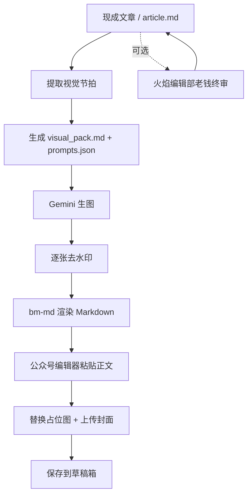

# 公众号配图发布

一个面向现成文章的公众号执行型技能包。

它默认不负责爆文逆向，也不默认改稿。输入是一篇已经写好的文章，输出是一套可以直接进入微信公众号草稿箱的交付链路：

1. 提取视觉节拍
2. 生成封面与正文配图提示词
3. 调用 Gemini 网页驱动生图
4. 独立执行去水印
5. 用 `bm-md` 渲染 Markdown
6. 自动投递到公众号草稿箱

如果用户明确要求“老钱风格 / 去 AI 味 / 老钱终审”，可以先调用 `huoyan-bianjibu-laoqian` 做一次可选终审，再进入本技能主链路。

## 适用场景

- 你已经有一篇写好的公众号文章
- 你想快速补齐封面图与正文配图
- 你想把图片去水印后直接送进公众号草稿箱
- 你想把这套流程单独打包并同步到远程仓库

## 目录结构

```text
gongzhonghao-peitu-fabu/
├── SKILL.md
├── README.md
├── LICENSE
├── .env.example
├── .gitignore
├── agents/
│   └── openai.yaml
├── references/
│   ├── setup.md
│   └── style-guide.md
├── scripts/
│   ├── __init__.py
│   ├── bootstrap_env.sh
│   ├── gemini_driver.py
│   ├── generate_images.py
│   ├── remove_watermark.py
│   ├── init_gemini_login.py
│   ├── init_wechat_login.py
│   ├── publish_article.py
│   ├── copy-to-clipboard.ts
│   ├── paste-from-clipboard.ts
│   ├── package.json
│   └── assets/
│       ├── bg_48.png
│       └── bg_96.png
└── assets/
    ├── generated_images/
    └── wechat_profile/
```

## 核心特点

- 现成文章直入：默认不改文，只做后处理与发布
- 技能内聚：`gemini_driver.py`、`remove_watermark.py` 和水印模板已经内置到技能目录
- 可选老钱终审：仅在用户明确要求时触发
- 可落地发布：已经包含 `bm-md`、公众号登录态、剪贴板粘贴、封面上传的完整链路
- 可远程同步：`.gitignore` 已排除登录态、生成图、缓存和本地环境文件

## 流程图



## 标准执行流程

### 1. 准备文章

输入应是一篇已经完成的文章。

建议在文章目录中准备：

- `article.md`
- `prompts.json`
- `visual_pack.md`

正文中建议使用这类占位符：

- `PICTUREONE`
- `PICTURETWO`
- `PICTURETHREE`
- `PICTUREFOUR`
- `PICTUREFIVE`

如果正文占位符比配图数量多，可以把封面图复用到 `PICTUREONE`，避免最终稿出现空块。

### 2. 生成视觉包

从文章里抽出：

- 最适合做封面的主视觉
- 2 到 5 个正文配图节拍
- 文中最适合视觉化的冲突、误解、反直觉点
- 历史、法规、工程、纪录片感等辅助线索

然后落盘：

- `visual_pack.md`
- `prompts.json`

`prompts.json` 示例：

```json
[
  { "name": "cover.jpg", "prompt": "..." },
  { "name": "01_scene.jpg", "prompt": "..." }
]
```

### 3. 生图

单张：

```bash
python3 scripts/generate_images.py --prompt 'cover.jpg::封面提示词'
```

批量：

```bash
python3 scripts/generate_images.py \
  --prompt 'cover.jpg::封面提示词' \
  --prompt '01_scene.jpg::正文图提示词1' \
  --prompt '02_scene.jpg::正文图提示词2'
```

默认会使用技能目录内置的 `scripts/gemini_driver.py`。

如果你有自己的驱动版本，也可以覆盖：

```bash
GEMINI_DRIVER_PATH=/custom/path/gemini_driver.py python3 scripts/generate_images.py ...
```

### 4. 去水印

对每张生成图单独调用：

```bash
python3 scripts/remove_watermark.py /abs/path/to/image.jpg
```

说明：

- 这是单图脚本，一次处理一张
- 如果输出 `No watermark detected`，直接保留原图
- 不要把去水印硬塞进生图主流程，保持它是独立阶段

### 5. 初始化登录

首次使用前建议先跑：

```bash
bash scripts/bootstrap_env.sh
python3 scripts/init_gemini_login.py
python3 scripts/init_wechat_login.py
```

说明：

- Gemini 登录态会写入技能目录下的 `.gemini/`
- 公众号登录态会写入 `assets/wechat_profile/`

### 6. 发布到草稿箱

```bash
python3 scripts/publish_article.py \
  --title "你的标题" \
  --markdown /abs/path/article.md \
  --cover /abs/path/cover.jpg \
  --inline-image PICTUREONE=/abs/path/01.jpg \
  --inline-image PICTURETWO=/abs/path/02.jpg \
  --inline-image PICTURETHREE=/abs/path/03.jpg
```

发布脚本会做这些事：

1. 用 `bm-md` 把 Markdown 渲染成 HTML
2. 把 HTML 复制进系统剪贴板
3. 打开公众号编辑器
4. 优先用浏览器内 `Meta+V` 完成正文粘贴
5. 逐个占位符替换成图片
6. 上传封面
7. 保存为草稿

## 依赖要求

### Python

需要这些包：

- `playwright`
- `requests`
- `python-dotenv`
- `opencv-python`
- `numpy`

安装浏览器：

```bash
playwright install chromium
```

### Bun

```bash
curl -fsSL https://bun.sh/install | bash
```

### bm-md

本技能依赖本地运行的 `bm-md`。

```bash
git clone https://github.com/miantiao-me/bm.md.git
cd bm.md
npm install
npm run dev
```

然后在 `.env` 里配置：

```bash
BM_MD_DIR="/path/to/your/bm-md"
```

如有需要，也可以直接设置渲染接口：

```bash
BM_MD_RENDER_URL="http://localhost:2663/api/markdown/render"
```

## 关键避坑

- 这不是写作技能，默认不要额外插入爆文逆向或分析步骤
- 生图程序一旦启动，不要中途打断
- 终端长时间没输出，不代表生图失败，先等进程自然退出再验文件
- 去水印要单独执行，不要因为“看起来能用”就跳过
- 发布前先确认 `assets/wechat_profile/` 不是空目录
- 如果 HTML 已复制成功但正文没贴进去，优先怀疑浏览器焦点或粘贴链路，不要先怪 `bm-md`
- 如果先发了带水印的版本，应该去水印后重新投递一版新草稿

## 适合推远程仓库的原因

这份技能已经把真正依赖的核心程序都带进目录里了：

- `scripts/gemini_driver.py`
- `scripts/remove_watermark.py`
- `scripts/assets/bg_48.png`
- `scripts/assets/bg_96.png`

同时 `.gitignore` 会排掉这些不该上传的内容：

- `.env`
- `.gemini/`
- `assets/wechat_profile/`
- `assets/generated_images/`
- `__pycache__/`

## 开源协议

本项目使用 [MIT License](LICENSE)。
